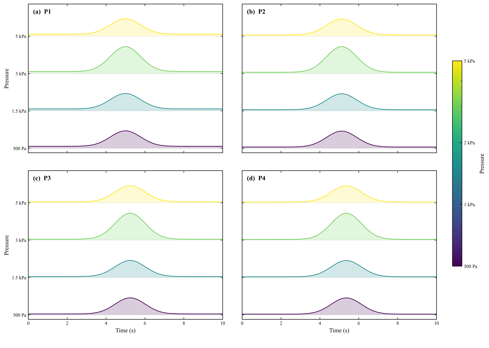

# Scientific Plotting Templates｜科研绘图模板

同一项研究往往要反复绘制时间曲线、组间比较图和模拟轨迹图。若每张图都从零设置坐标、单位和配色，不仅费时，也容易让同一组结果采用不一致的尺度。本仓库把常用的绘图脚本放在独立目录，便于检查输入列、调整样式，并用相同的规则重新生成图片。

目前包括颗粒活跃度 PAI 岭线图、起跳指标与压强对比、粒径累计分布及 D10/D50/D90，以及 COMSOL 颗粒轨迹与荷电图。各脚本保留可修改的参数和输出路径。`generate_demo_data.py` 生成的表格只用于试运行和查看版式，不是实验或仿真结果。



## 快速开始

```powershell
python -m pip install -r requirements.txt
python generate_demo_data.py
python templates/pai_ridgeline/plot_pai_ridgeline.py
python templates/jump_metrics/plot_jump_metrics.py
python templates/particle_size_distribution/plot_particle_size_distribution.py --input templates/particle_size_distribution/data/synthetic_particle_size_distribution.xlsx --output templates/particle_size_distribution/psd_demo.png
python templates/comsol_trajectories/plot_comsol_trajectories.py templates/comsol_trajectories/data/synthetic_comsol_particle_dataset.xlsx --output-dir templates/comsol_trajectories/demo_plots --dpi 150 --png-only
```

PAI 另有 `plot_pai_peak_aligned.py`，用于比较峰值时间对齐后的曲线形状；对齐后的横坐标不能当作原始事件时间。更多预览在 `examples/expected/`。

| 模板 | 所需输入 | 示例所在位置 |
|---|---|---|
| PAI 岭线 | `P1`–`P4` 各目录下按压强命名的 CSV，例如 `3000pa.csv`；列为 `time_ms_based_on_capture_fps`、`particle_activity_index` | `templates/pai_ridgeline/input_pai_groups/` |
| 起跳指标 | 每组一个 CSV/XLSX；列为 `pressure_Pa`、`segment_id`、`jump_height_mm`、`horizontal_displacement_mm_abs` | `templates/jump_metrics/input_data/` |
| 粒径分布 | Excel 前 8 列按四组排列：每组“粒径 μm、累计百分比” | `templates/particle_size_distribution/data/` |
| COMSOL 轨迹 | Excel `Data_Long` 工作表；列为 `Particle_Index`、`Pm`、`Time_s`、`qx_m`、`qy_m`、`Velocity_m_per_s`、`Charge_Number_Z` | `templates/comsol_trajectories/data/` |

脚本可输出高分辨率图片，部分还会生成 PDF 或 CSV。用于论文或报告前，应核对单位、样品组名、压强范围、统计重复层级和图中标注；合成示例不能替代真实数据检查。
